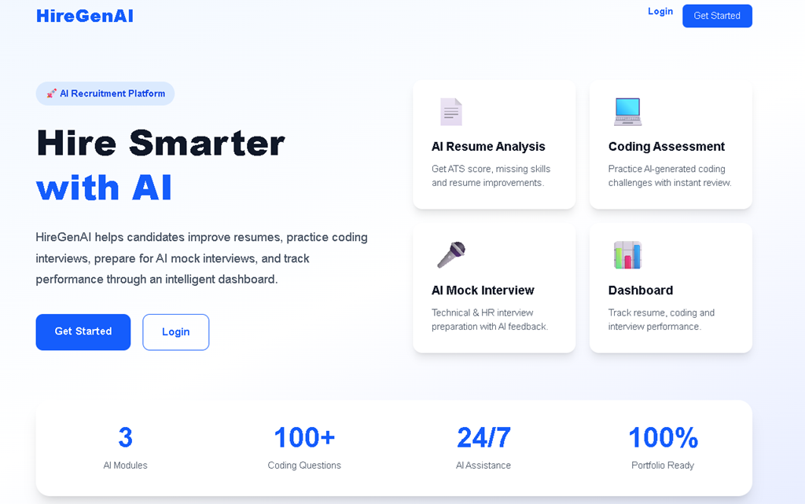
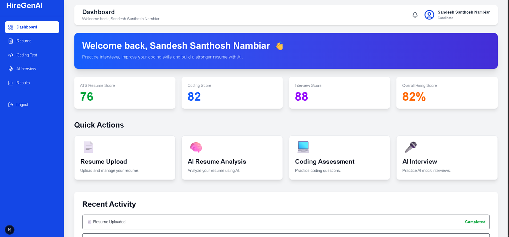
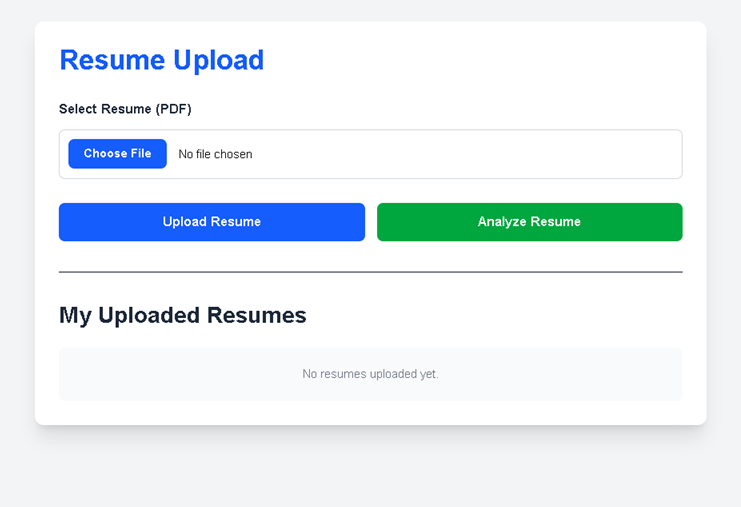
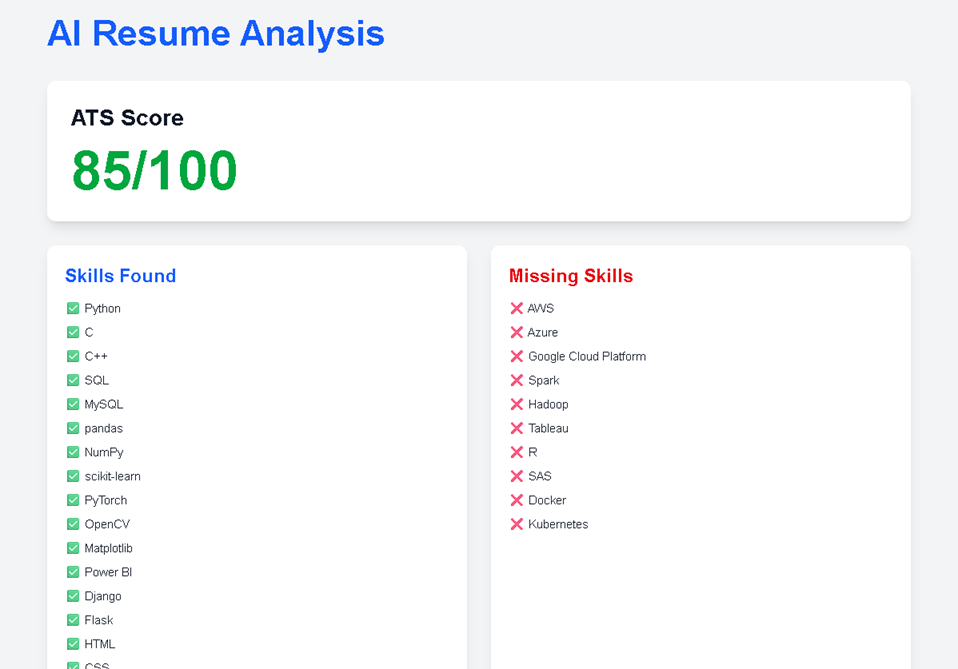
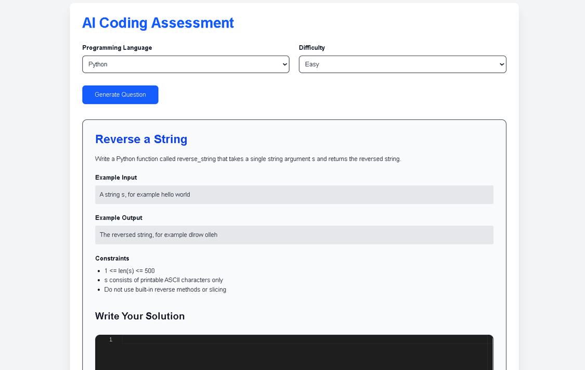
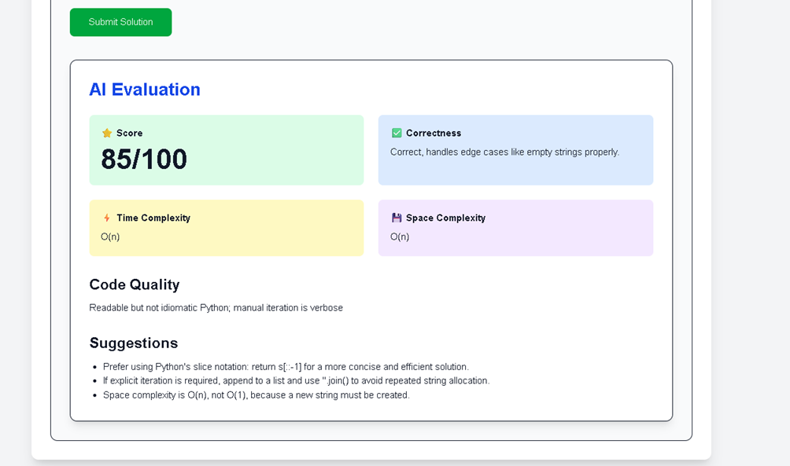
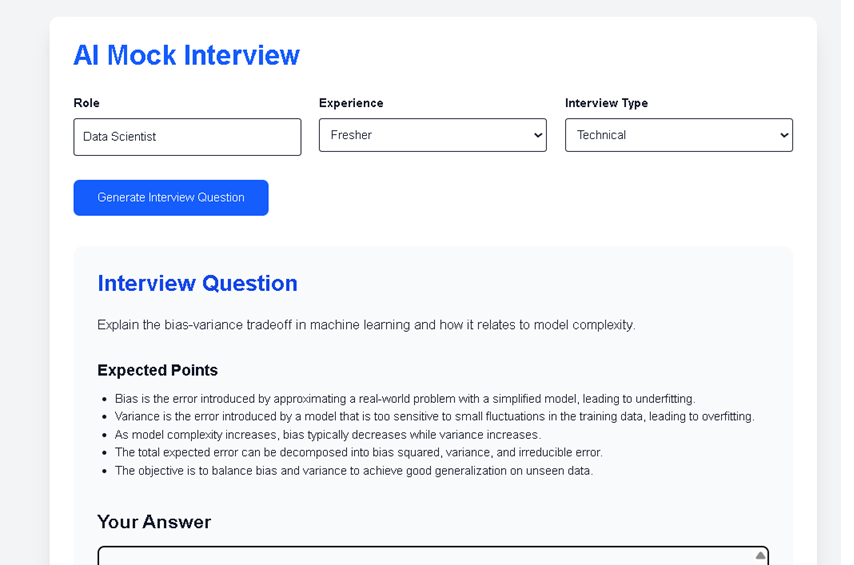
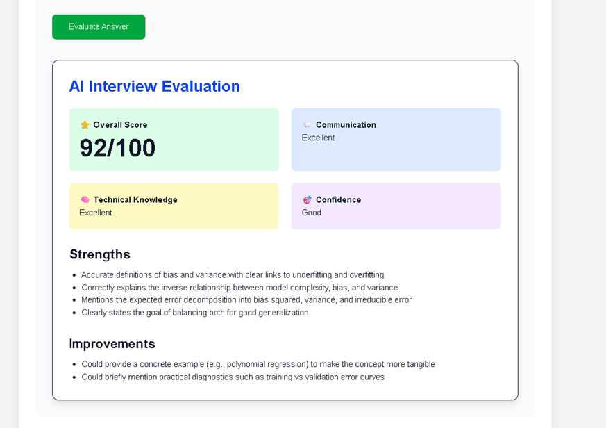

# 🚀 HireGenAI


> AI-Powered Recruitment Platform built using Next.js, Express.js, MongoDB and OpenRouter AI.

---

## 📌 Overview

HireGenAI is an AI-powered recruitment platform designed to streamline the hiring process for both candidates and recruiters.

The platform provides intelligent resume analysis, coding assessments, AI mock interviews, and a centralized dashboard to help candidates improve their hiring readiness.

---

## ✨ Features

### 🔐 Authentication
- User Registration
- User Login
- JWT Authentication
- Protected Routes

---

### 📄 Resume Module

- Upload Resume (PDF)
- View Uploaded Resumes
- Download Resume
- Delete Resume
- Resume Management

---

### 🤖 AI Resume Analysis

- ATS Score
- Skills Extraction
- Missing Skills Detection
- Resume Strengths
- Resume Improvement Suggestions

---

### 💻 Coding Assessment

- AI Coding Question Generation
- Multiple Programming Languages
- Multiple Difficulty Levels
- Monaco (VS Code) Editor
- AI Code Review
- Complexity Analysis
- Code Quality Evaluation

---

### 🎤 AI Mock Interview

- Technical Interview Questions
- HR Interview Questions
- Behavioral Interview Questions
- AI Interview Evaluation
- Communication Analysis
- Technical Knowledge Analysis
- Confidence Assessment
- Improvement Suggestions

---

### 📊 Dashboard

- User Dashboard
- Resume Score
- Coding Score
- Interview Score
- Overall Hiring Score
- Recent Activity

---

## 🛠 Tech Stack

### Frontend

- Next.js
- React.js
- Tailwind CSS
- Axios

### Backend

- Node.js
- Express.js
- JWT Authentication
- Multer

### Database

- MongoDB Atlas
- Mongoose

### AI

- OpenRouter AI
- Large Language Models (LLMs)

---

## 📂 Project Structure

```
HireGenAI

client/
components/
app/

server/
controllers/
routes/
models/
middleware/
uploads/

README.md
```

---

## ⚙️ Installation

### Clone Repository

```bash
git clone https://github.com/YOUR_USERNAME/HireGenAI.git
```

### Install Dependencies

Frontend

```bash
cd client
npm install
```

Backend

```bash
cd server
npm install
```

### Run Backend

```bash
npm run dev
```

### Run Frontend

```bash
npm run dev
```

---

## 🔑 Environment Variables

Create a `.env` file inside the **server** folder.

```
PORT=

MONGO_URI=

JWT_SECRET=

OPENROUTER_API_KEY=
```

---

## 📸 Screenshots

### 🏠 Landing Page



---

### 📊 Dashboard



---

### 📄 Resume Upload



---

### 🤖 AI Resume Analysis



---

### 💻 Coding Assessment



---

### 🧠 AI Code Review



---

### 🎤 AI Mock Interview



---

### ⭐ AI Interview Evaluation


---

## 🚀 Deployment

This project is deployment-ready.

Recommended platforms:

- Frontend → Vercel
- Backend → Render / Railway
- Database → MongoDB Atlas

---

## 🔮 Future Enhancements

- Recruiter Dashboard
- Email Notifications
- Resume Versioning
- AI Career Recommendation
- Company Job Matching
- Multi-language Interview Support

---

## 👨‍💻 Author

**Sandesh S N**

M.Tech Data Science & Engineering

GitHub:
https://github.com/sandeshsn-official

---

## ⭐ If you like this project

Please consider giving it a ⭐ on GitHub.